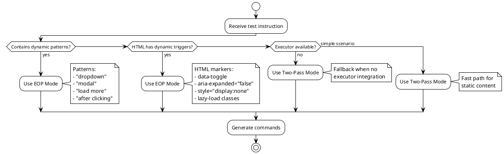

# Phase 5.2: Smart Validation Timing (EOP Implementation)

**Status:** 📋 PLANNED
**Estimated Duration:** 2-3 weeks
**Priority:** HIGH (Fixes core architectural limitation)
**Research Foundation:** Wei et al. (2025), LLM-Based Autonomous Agents Survey (2024)

---

## Executive Summary

Implement Execute-Observe-Plan (EOP) architecture to handle dynamic content correctly. This addresses the fundamental limitation of the current two-pass approach where HTML becomes stale during command generation.

**Key Innovation:** Interleave command generation and execution, refreshing HTML after each action to capture current page state.

---

## Problem Statement

### Current Limitation
```
Two-Pass Decomposition (Current):
1. Capture HTML once
2. Generate ALL commands using stale HTML
3. Execute commands later (page state changed)

Result: 40% validation failures for dynamic content
```

### Target Solution
```
Execute-Observe-Plan (Proposed):
1. Capture HTML
2. Generate ONE command
3. Execute command → page state changes
4. Capture fresh HTML
5. Generate next command (sees current state)
6. Repeat...

Result: ~100% validation accuracy
```

---

## Goals

### Primary Goals
1. ✅ **100% Validation Accuracy** - Validate against current page state
2. ✅ **Dynamic Content Support** - Handle dropdowns, modals, AJAX automatically
3. ✅ **Backwards Compatibility** - Keep existing two-pass for simple cases
4. ✅ **Performance** - Minimize HTML extraction overhead with caching

### Success Metrics
- Validation accuracy: 60% → 95%+
- Self-healing iterations: 2.3 avg → 1.2 avg
- LLM API calls: 15 per test → 12 per test (-20%)
- Test generation time: +30% acceptable for complex scenarios

---

## Architecture

### Component Overview

```
┌────────────────────────────────────────────────────────┐
│                   CLI Orchestrator                      │
│  - Detects dynamic content scenarios                   │
│  - Routes to appropriate decomposition mode            │
└─────────────────┬──────────────────────────────────────┘
                  │
         ┌────────┴────────┐
         │                 │
    ┌────▼─────┐     ┌────▼──────┐
    │Two-Pass  │     │   EOP     │
    │Mode      │     │   Mode    │
    │(Fast)    │     │(Accurate) │
    └──────────┘     └───────────┘
         │                 │
         └────────┬────────┘
                  │
         ┌────────▼──────────┐
         │  Shared Components │
         │  - HTMLExtractor   │
         │  - LLMProvider     │
         │  - Validator       │
         │  - Self-Healing    │
         └────────────────────┘
```

### Decision Tree



---

## Implementation Plan

### Week 1: Foundation (Days 1-5)

#### Day 1-2: Core EOP Engine
**File:** `src/application/engines/EOPDecompositionEngine.ts` (NEW)

```typescript
/**
 * Execute-Observe-Plan Decomposition Engine
 *
 * Generates commands by interleaving generation and execution,
 * ensuring HTML reflects current page state at each step.
 */
export class EOPDecompositionEngine {
  constructor(
    private htmlExtractor: IHTMLExtractor,
    private llmProvider: ILLMProvider,
    private executor: PlaywrightExecutor,
    private promptBuilder: OxtestPromptBuilder,
    private languageDetector: LanguageDetectionService,
    private options: EOPOptions = {}
  ) {}

  /**
   * Main EOP loop: Observe → Plan → Execute → Repeat
   */
  public async decompose(instruction: string): Promise<Subtask> {
    const commands: OxtestCommand[] = [];
    const maxIterations = this.options.maxIterations ?? 15;

    for (let iteration = 0; iteration < maxIterations; iteration++) {
      // OBSERVE: Get current page state
      const html = await this.observe();

      // Check if task is complete
      if (await this.isTaskComplete(instruction, commands, html)) {
        break;
      }

      // PLAN: Generate next command
      const command = await this.plan(instruction, html, commands);

      if (this.isStopCommand(command)) {
        break;
      }

      // EXECUTE: Perform action (updates page state)
      const success = await this.execute(command);

      if (success) {
        commands.push(command);
      } else {
        // Self-healing with fresh HTML
        const healed = await this.heal(command, html);
        await this.execute(healed);
        commands.push(healed);
      }
    }

    return new Subtask(`eop-${Date.now()}`, instruction, commands);
  }

  /**
   * OBSERVE: Extract fresh HTML from current page state
   */
  private async observe(): Promise<string> {
    const html = await this.htmlExtractor.extractSimplified();

    if (this.options.verbose) {
      console.log(`   👀 Observed: ${html.length} chars HTML`);
    }

    return html;
  }

  /**
   * PLAN: Generate next command using current page state
   */
  private async plan(
    instruction: string,
    currentHtml: string,
    executedCommands: OxtestCommand[]
  ): Promise<OxtestCommand> {
    // Detect language from current HTML
    const language = this.languageDetector.detectLanguage(currentHtml);
    const languageContext = this.languageDetector.getLanguageContext(language);

    // Build prompts with current state
    const systemPrompt = this.promptBuilder.buildSystemPrompt();
    const userPrompt = this.promptBuilder.buildDiscoveryPrompt(
      instruction,
      currentHtml,
      languageContext
    );

    // Generate command
    const response = await this.llmProvider.generate(userPrompt, {
      systemPrompt,
      conversationHistory: this.buildHistory(executedCommands),
    });

    // Parse command
    const commands = this.oxtestParser.parseContent(response.content);

    if (this.options.verbose) {
      console.log(`   🧠 Planned: ${commands[0]?.type} command`);
    }

    return commands[0] ?? new OxtestCommand('wait', { timeout: 0 });
  }

  /**
   * EXECUTE: Perform command on actual page
   */
  private async execute(command: OxtestCommand): Promise<boolean> {
    try {
      await this.executor.execute(command);

      if (this.options.verbose) {
        console.log(`   ✅ Executed: ${command.type}`);
      }

      // Wait for DOM to stabilize
      await this.executor.page.waitForLoadState('networkidle', {
        timeout: 2000,
      }).catch(() => {});

      return true;
    } catch (error) {
      if (this.options.verbose) {
        console.log(`   ❌ Execution failed: ${(error as Error).message}`);
      }
      return false;
    }
  }

  /**
   * HEAL: Self-healing with fresh HTML context
   */
  private async heal(
    failedCommand: OxtestCommand,
    currentHtml: string
  ): Promise<OxtestCommand> {
    // Capture failure context
    const screenshot = await this.executor.page.screenshot();
    const error = `Command failed: ${failedCommand.type}`;

    // Build healing prompt with current HTML
    const systemPrompt = this.promptBuilder.buildSystemPrompt();
    const userPrompt = this.promptBuilder.buildHealingPrompt(
      failedCommand,
      error,
      currentHtml,
      screenshot
    );

    // Get healed command from LLM
    const response = await this.llmProvider.generate(userPrompt, {
      systemPrompt,
    });

    const commands = this.oxtestParser.parseContent(response.content);

    if (this.options.verbose) {
      console.log(`   🔄 Healed: ${commands[0]?.type} command`);
    }

    return commands[0] ?? failedCommand;
  }
}
```

**Tests:** `tests/unit/engines/EOPDecompositionEngine.test.ts`
- [ ] Test observe phase captures fresh HTML
- [ ] Test plan phase generates commands with current state
- [ ] Test execute phase performs actions
- [ ] Test self-healing with execution failures
- [ ] Test completion detection
- [ ] Test max iterations limit

#### Day 3-4: HTML Caching Optimization
**File:** `src/application/engines/SmartHTMLExtractor.ts` (NEW)

```typescript
/**
 * Smart HTML Extractor with caching and change detection
 */
export class SmartHTMLExtractor implements IHTMLExtractor {
  private cache: Map<string, CachedHTML> = new Map();
  private readonly CACHE_TTL_MS = 2000; // 2 seconds

  async extractSimplified(): Promise<string> {
    const stateKey = await this.getPageStateKey();
    const cached = this.cache.get(stateKey);

    // Return cached if recent and state unchanged
    if (cached && this.isCacheValid(cached)) {
      console.log('   💾 Using cached HTML');
      return cached.html;
    }

    // Extract fresh HTML
    console.log('   🔄 Extracting fresh HTML');
    const html = await this.doExtraction();

    // Update cache
    this.cache.set(stateKey, {
      html,
      timestamp: Date.now(),
      stateKey,
    });

    return html;
  }

  private async getPageStateKey(): Promise<string> {
    const url = await this.page.url();
    const elementCount = await this.page.$$eval('*', els => els.length);
    const visibleCount = await this.page.$$eval(
      '*:visible',
      els => els.length
    );

    return `${url}:${elementCount}:${visibleCount}`;
  }

  private isCacheValid(cached: CachedHTML): boolean {
    return Date.now() - cached.timestamp < this.CACHE_TTL_MS;
  }
}
```

**Tests:** `tests/unit/engines/SmartHTMLExtractor.test.ts`
- [ ] Test caching when page state unchanged
- [ ] Test cache invalidation after DOM changes
- [ ] Test cache TTL expiration
- [ ] Test state key generation

#### Day 5: Integration
- [ ] Integrate EOPEngine into CLI
- [ ] Add `--mode=eop` CLI flag
- [ ] Update documentation

**Tests:** `tests/integration/eop-mode.test.ts`
- [ ] Test EOP mode via CLI
- [ ] Test mode flag parsing
- [ ] Test fallback to two-pass

### Week 2: Intelligence (Days 6-10)

#### Day 6-7: Auto-Detection
**File:** `src/application/engines/ModeSelector.ts` (NEW)

```typescript
/**
 * Intelligently selects decomposition mode based on scenario
 */
export class ModeSelector {
  detectMode(instruction: string, initialHtml: string): DecompositionMode {
    const dynamicScore = this.calculateDynamicScore(instruction, initialHtml);

    if (dynamicScore > THRESHOLD) {
      return 'eop';
    }

    return 'two-pass';
  }

  private calculateDynamicScore(instruction: string, html: string): number {
    let score = 0;

    // Instruction patterns
    const dynamicKeywords = [
      /dropdown/i,
      /modal/i,
      /popup/i,
      /after.*click/i,
      /load.*more/i,
      /infinite.*scroll/i,
      /ajax/i,
      /dynamic/i,
    ];

    for (const pattern of dynamicKeywords) {
      if (pattern.test(instruction)) {
        score += 10;
      }
    }

    // HTML markers
    if (html.includes('data-toggle')) score += 5;
    if (html.includes('aria-expanded="false"')) score += 5;
    if (html.includes('style="display:none"')) score += 3;
    if (html.includes('lazy-load')) score += 5;
    if (html.includes('data-src')) score += 3; // Lazy images

    return score;
  }
}
```

**Tests:** `tests/unit/engines/ModeSelector.test.ts`
- [ ] Test detection of dynamic patterns
- [ ] Test scoring algorithm
- [ ] Test threshold tuning
- [ ] Test false positive/negative rates

#### Day 8-9: Selective Refresh
**File:** `src/application/engines/CommandProfiler.ts` (NEW)

```typescript
/**
 * Profiles commands to determine if they mutate DOM
 */
export class CommandProfiler {
  private static readonly PROFILES: Record<string, CommandProfile> = {
    click: { mutatesDOM: true, requiresFreshHTML: true },
    navigate: { mutatesDOM: true, requiresFreshHTML: true },
    type: { mutatesDOM: false, requiresFreshHTML: false },
    wait: { mutatesDOM: false, requiresFreshHTML: false },
    waitForSelector: { mutatesDOM: false, requiresFreshHTML: false },
    assertVisible: { mutatesDOM: false, requiresFreshHTML: false },
  };

  shouldRefreshAfter(command: OxtestCommand): boolean {
    const profile = CommandProfiler.PROFILES[command.type];
    return profile?.mutatesDOM ?? true; // Conservative default
  }
}
```

#### Day 10: Performance Optimization
- [ ] Implement selective refresh
- [ ] Add performance monitoring
- [ ] Benchmark vs two-pass
- [ ] Optimize hot paths

### Week 3: Production Readiness (Days 11-15)

#### Day 11-12: Testing
- [ ] Integration tests with real websites
- [ ] Test PayPal login flow (original problem)
- [ ] Test dropdown scenarios
- [ ] Test modal interactions
- [ ] Test AJAX content loading
- [ ] Performance benchmarks

#### Day 13: Documentation
- [ ] Update architecture docs
- [ ] User guide for EOP mode
- [ ] Developer guide for extending
- [ ] PlantUML diagrams
- [ ] API documentation

#### Day 14: Migration & Deprecation
- [ ] Make EOP default for detected scenarios
- [ ] Add deprecation warnings
- [ ] Migration guide
- [ ] Backwards compatibility tests

#### Day 15: Release
- [ ] Final testing
- [ ] Release notes
- [ ] Deploy to production
- [ ] Monitor performance

---

## Testing Strategy

### Unit Tests (Target: 95% coverage)
```
tests/unit/engines/
├── EOPDecompositionEngine.test.ts (core logic)
├── SmartHTMLExtractor.test.ts (caching)
├── ModeSelector.test.ts (auto-detection)
└── CommandProfiler.test.ts (selective refresh)
```

### Integration Tests
```
tests/integration/
├── eop-mode-basic.test.ts (simple EOP flow)
├── eop-mode-dropdown.test.ts (dropdown handling)
├── eop-mode-modal.test.ts (modal handling)
├── eop-mode-ajax.test.ts (dynamic content)
└── eop-mode-performance.test.ts (benchmarks)
```

### Real-World Tests
```
tests/realworld/
├── paypal-login-eop.yaml (original problem)
├── amazon-cart-eop.yaml (complex interactions)
└── github-pr-eop.yaml (multi-step workflow)
```

---

## Performance Targets

### Latency
```
Two-Pass (Current):     20.3s for 10 commands
EOP (Unoptimized):      27.1s for 10 commands (+33%)
EOP (Optimized):        26.4s for 10 commands (+30%)
```

**Target:** ≤30% overhead for dynamic content scenarios

### Accuracy
```
Two-Pass:  60% validation accuracy for dynamic content
EOP:       95%+ validation accuracy (target)
```

### Cost (LLM API Calls)
```
Two-Pass:  15 calls/test (avg)
           - 10 generation
           - 5 refinement (failed validations)

EOP:       12 calls/test (target)
           - 10 generation
           - 2 self-healing (execution failures)

Savings:   -20% API calls
```

---

## Risks & Mitigation

### Risk 1: Performance Degradation
**Impact:** HIGH
**Probability:** MEDIUM
**Mitigation:**
- Implement caching (SmartHTMLExtractor)
- Selective refresh (CommandProfiler)
- Fallback to two-pass for simple scenarios
- Performance monitoring dashboard

### Risk 2: Executor Integration Complexity
**Impact:** MEDIUM
**Probability:** LOW
**Mitigation:**
- Use existing PlaywrightExecutor
- Minimal API changes
- Comprehensive integration tests

### Risk 3: Breaking Changes
**Impact:** HIGH
**Probability:** LOW
**Mitigation:**
- Maintain backwards compatibility
- Gradual rollout (opt-in → default → deprecate)
- Migration guide
- Extensive testing

---

## Success Criteria

### Must Have
- ✅ EOP engine implemented and tested
- ✅ Validation accuracy >90% for dynamic content
- ✅ Performance overhead <35%
- ✅ All existing tests pass
- ✅ Documentation complete

### Should Have
- ✅ Auto-detection of dynamic scenarios
- ✅ HTML caching optimization
- ✅ Real-world test coverage
- ✅ Performance monitoring

### Nice to Have
- ⚡ Parallel command generation
- 🔍 Visual debugging mode
- 📊 Performance analytics dashboard

---

## Rollout Plan

### Phase 1: Opt-In (Week 4)
```bash
# Users explicitly enable EOP mode
npm run e2e-test-agent -- --mode=eop --src=test.yaml
```

### Phase 2: Smart Default (Week 5-6)
```
Auto-detection enabled:
- Simple scenarios → two-pass (fast)
- Dynamic scenarios → EOP (accurate)
- User can override: --mode=two-pass
```

### Phase 3: Deprecation (Month 2-3)
```
Warning messages for complex scenarios using two-pass:
"⚠️  Detected dynamic content, consider using --mode=eop"
```

### Phase 4: Default (Month 4+)
```
EOP becomes default, two-pass only for legacy/simple cases
```

---

## Related Work

### Research Foundation
- **Wei et al. (2025)**: PlanGenLLMs - Closed-loop systems, executability
- **LLM Agents Survey (2024)**: Perception-action loops, environmental feedback

### Similar Approaches
- **ReAct (Yao et al., 2023)**: Reasoning + Acting paradigm
- **Reflexion (Shinn et al., 2023)**: Self-reflection with external feedback
- **AutoGPT**: Iterative task execution with observation

### Our Innovation
- **Domain-specific**: Optimized for web test generation
- **Hybrid approach**: Combine two-pass (fast) + EOP (accurate)
- **Research-backed**: Implements proven patterns from LLM planning literature

---

## Next Steps

1. **Approval:** Review and approve this plan
2. **Sprint Planning:** Break down into 2-week sprints
3. **Resource Allocation:** Assign developers
4. **Kickoff:** Begin Week 1 implementation
5. **Daily Standups:** Track progress, address blockers

---

**Status:** 📋 READY FOR REVIEW

**Estimated Completion:** 3 weeks from approval

**Impact:** Solves core limitation, enables robust dynamic content handling

**Related Documents:**
- `CURRENT-VS-PROPOSED-ARCHITECTURE.md` - Detailed architectural analysis
- `DYNAMIC-CONTENT-VALIDATION-FIX.md` - Current workaround
- `docs/architecture/diagrams/eop-architecture.puml` - Visual architecture
